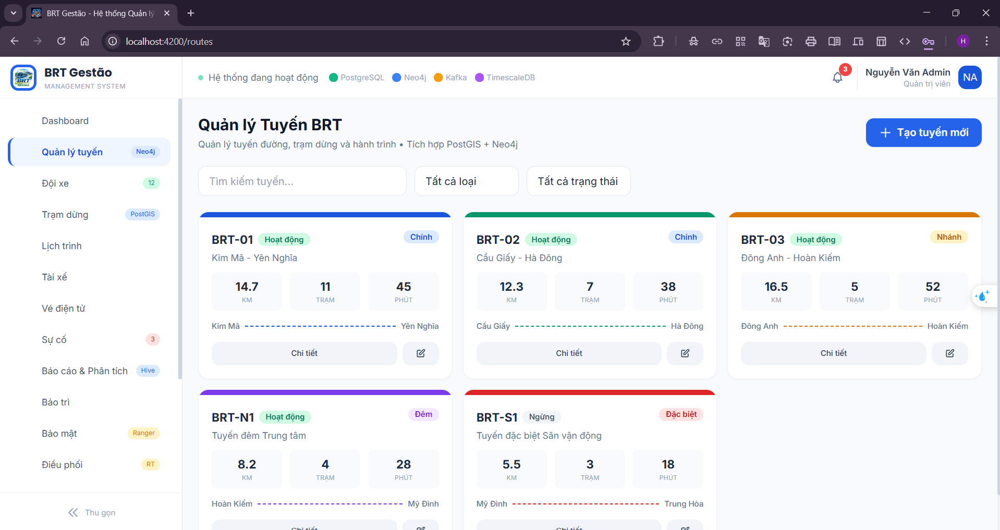
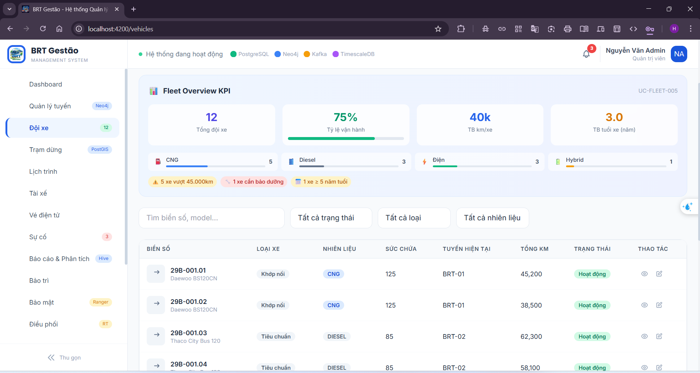
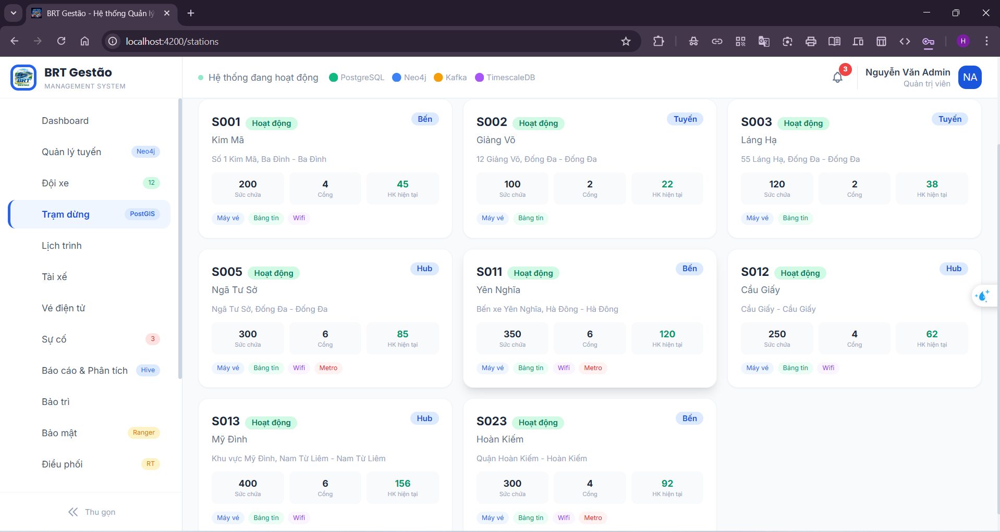
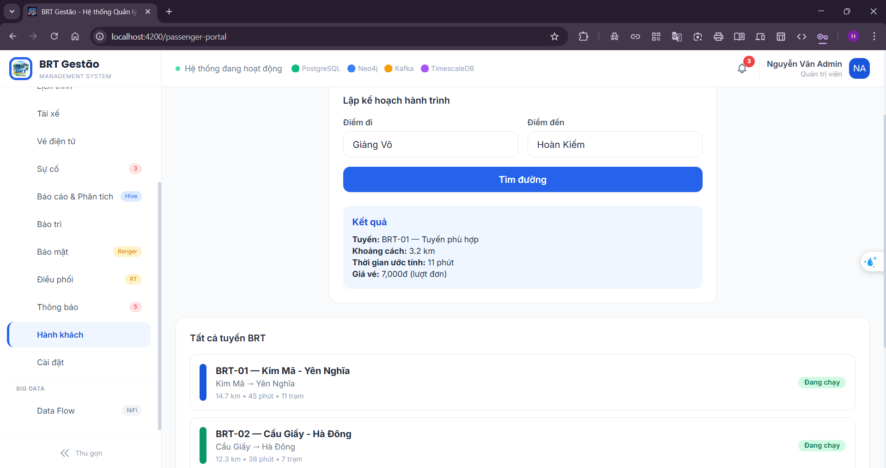
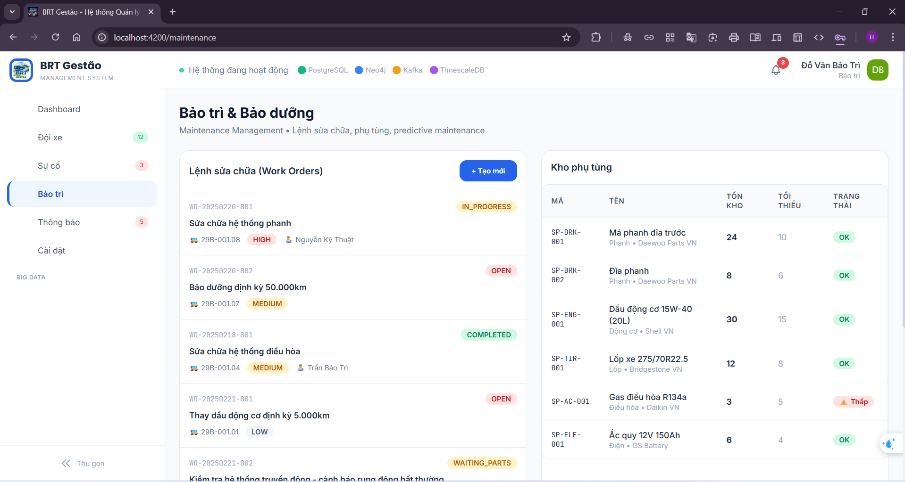

# BRT Gestão

Nền tảng quản lý vận hành xe buýt nhanh BRT Hà Nội — phục vụ 17 nghiệp vụ cốt lõi: Dashboard, Tuyến BRT, Xe buýt, Trạm dừng, Tài xế, Lịch trình & Chuyến xe, Điều phối xe, Vé & Thanh toán, Ví điện tử, Sự cố, Bảo trì & Phụ tùng, Analytics & Báo cáo, Hành khách, Data Platform, Bảo mật & Audit, Thông báo, Cài đặt.










**Frontend** chạy độc lập bằng mock data, sẵn sàng kết nối **13 microservices** backend chỉ bằng 1 dòng config.

```
Tech Stack
├── Frontend:   Angular 17 · Tailwind CSS · NgRx · Chart.js · Leaflet · RxJS · TypeScript
└── Backend:    Java 21 · Spring Boot 3.2 · Spring Cloud Gateway · Eureka · Config Server
                PostgreSQL 16 · PostGIS (spatial) · TimescaleDB (time-series) · Neo4j 5 (graph)
                Apache Kafka · Apache NiFi · Hadoop HDFS · Apache Hive · Apache Ranger
                Kylo (data quality) · Resilience4j · Flyway · SpringDoc OpenAPI
                Prometheus · Grafana · ELK Stack · Docker
```

---

## Tài liệu

```
READ_FIRST/                Đọc trước khi làm bất cứ việc gì
├── architecture.md          Kiến trúc 13 microservices, 8 ADRs, sơ đồ giao tiếp sync/async
├── business-flows.md        10 luồng nghiệp vụ chính với sequence diagram chi tiết
└── rbac-matrix.md           3 lớp phân quyền: UI sidebar · API endpoint · data row/column

READ_FRONTEND/             Dành cho frontend developer
├── frontend-structure.md    Cây file Angular 17, 43 components, 17 modules, 8 NgRx stores
├── frontend-conventions.md  Standalone components, NgRx pattern, Tailwind, naming conventions
└── mock-data.md             32 datasets, 5 tuyến, 12 xe, 8 tài xế, seed data khớp backend

READ_BACKEND/              Dành cho backend developer
├── backend-structure.md     13 microservices, ports 8080-8093, package structure chuẩn
├── api-contracts.md         60+ endpoints REST, pagination, error format, auth header
├── database-schema.md       29 tables DDL, PostGIS, TimescaleDB hypertables, Neo4j Cypher, Hive
└── kafka-events.md          10 topics, payload JSON schema, partition strategy, DLQ config

READ_DEPLOY/               Dành cho DevOps / người cài đặt
├── environment-window.md    Cài đặt toàn bộ môi trường trên Windows từ đầu
├── docker-compose.md        Toàn bộ hạ tầng 1 file: PostgreSQL + Neo4j + Kafka + NiFi + Hadoop
├── coding-conventions.md    Quy tắc code Java · Angular · Git workflow, PR checklist
├── testing-guide.md         Pyramid 70/20/5/5, coverage targets, Testcontainers, JaCoCo
└── troubleshooting.md       Debug startup · runtime · distributed tracing · symptom checklist
```

---

## Chạy nhanh (chỉ Frontend)

```bash
cd brt-gestao
npm install
ng serve
```

Mở http://localhost:4200 — đăng nhập bằng username và password tương ứng.

**7 tài khoản demo:**

| Username | Password | Role | Trang mặc định |
|---|---|---|---|
| `admin` | `admin123` | Admin | Dashboard + tất cả 17 modules |
| `opsmanager` | `ops123` | Ops Manager | Dashboard + quản lý vận hành |
| `dispatcher1` | `disp123` | Dispatcher | Dashboard + điều phối xe |
| `driver01` | `drv123` | Driver | Dashboard + tuyến, lịch, sự cố |
| `maint1` | `mnt123` | Maintenance | Dashboard + bảo trì, phụ tùng |
| `analyst1` | `ana123` | Analyst | Dashboard + analytics, data platform |
| `finance1` | `fin123` | Finance | Dashboard + vé, doanh thu, báo cáo |

---

## Kết nối Backend

Frontend hiện dùng mock data nội bộ. Khi backend sẵn sàng, kết nối bằng cách:

### Bước 1 — Đổi API base URL

Mở `src/environments/environment.ts`:

```typescript
// ❌ Mock mode (mặc định)
export const environment = {
  production: false,
  apiBaseUrl: '',              // rỗng = dùng mock data
  wsBaseUrl: '',
};

// ✅ Backend mode
export const environment = {
  production: false,
  apiBaseUrl: 'http://localhost:8080/api',    // API Gateway
  wsBaseUrl: 'ws://localhost:8080/ws',        // WebSocket
};
```

### Bước 2 — Chuyển Services từ mock sang HTTP

Mỗi service trong `src/app/core/services/` chỉ cần thay đổi 1 chỗ:

```typescript
// ❌ Mock mode hiện tại
@Injectable({ providedIn: 'root' })
export class RouteService {
  getAll(): Observable<BrtRoute[]> {
    return of(MOCK_ROUTES).pipe(delay(300));
  }
}

// ✅ Backend mode — chỉ thay nội dung methods
@Injectable({ providedIn: 'root' })
export class RouteService {
  private url = `${environment.apiBaseUrl}/routes`;
  constructor(private http: HttpClient) {}

  getAll(): Observable<BrtRoute[]> {
    return this.http.get<ApiResponse<BrtRoute[]>>(this.url)
      .pipe(map(res => res.data));
  }
}
```

Tất cả 6 service files cần sửa:

| File | Mock → HTTP |
|---|---|
| `auth.service.ts` | `MOCK_CREDENTIALS` → `POST /api/auth/login` |
| `route.service.ts` | `MOCK_ROUTES` → `GET/POST/PUT/DELETE /api/routes` |
| `vehicle.service.ts` | `MOCK_VEHICLES` → `GET/POST/PUT/DELETE /api/vehicles` |
| `data.service.ts` | `MOCK_*` (tổng hợp) → Nhiều endpoints |
| `notification.service.ts` | `MOCK_NOTIFICATIONS` → `GET /api/notifications` |
| `audit.service.ts` | `MOCK_AUDIT_LOGS` → `GET /api/audit-logs` |

### Bước 3 — Bật HTTP Interceptors

Mở `src/app/app.config.ts`, đảm bảo interceptors đã được register:

```typescript
export const appConfig: ApplicationConfig = {
  providers: [
    provideHttpClient(
      withInterceptors([authInterceptor, errorInterceptor])
    ),
    // ...
  ]
};
```

Interceptors đã có sẵn trong `src/app/core/interceptors/`:
- **authInterceptor**: Tự gắn `Authorization: Bearer {token}` vào mọi request
- **errorInterceptor**: Xử lý 401 → logout, 403 → redirect `/forbidden`, 500 → toast error

### Bước 4 — Bật WebSocket cho Real-time

Vehicle tracking trên Leaflet map cần WebSocket để nhận GPS position mỗi 5 giây:

```typescript
// src/app/core/services/vehicle.service.ts

// ❌ Mock mode: fake random position
getPositions(): Observable<VehiclePosition[]> {
  return of(MOCK_VEHICLE_POSITIONS.map(p => ({
    ...p,
    lat: p.lat + (Math.random() - 0.5) * 0.002,
  }))).pipe(delay(100));
}

// ✅ Backend mode: subscribe WebSocket topic
getPositions(): Observable<VehiclePosition[]> {
  return this.stompService
    .watch('/topic/vehicle-positions')
    .pipe(map(msg => JSON.parse(msg.body)));
}
```

### Bước 5 — Khởi động Backend

```powershell
# 1. Infrastructure (PostgreSQL + Neo4j + Kafka + NiFi + Hadoop)
docker compose -f docker-compose.infra.yml up -d

# 2. Chờ healthy
docker compose -f docker-compose.infra.yml ps

# 3. Khởi động services (theo thứ tự)
#    Config Server → Eureka → Gateway → Business services
docker compose up -d

# 4. Kiểm tra
curl http://localhost:8080/actuator/health    # API Gateway
curl http://localhost:8761                     # Eureka Dashboard
```

### Bước 6 — Verify

```
Frontend (http://localhost:4200)
    ↓ HTTP requests
API Gateway (http://localhost:8080)
    ↓ route to services
┌─────────────────────────────────────────┐
│ auth:8081 │ route:8082 │ vehicle:8083   │
│ station:8084 │ driver:8085 │ sched:8086 │
│ ticket:8087 │ incident:8088 │ maint:8089│
│ analytics:8090 │ notif:8091 │ data:8092 │
│ passenger:8093                          │
└─────────────────────────────────────────┘
    ↓ events
Kafka (localhost:9092) → NiFi → HDFS → Hive
```

Đăng nhập `admin / admin123` → Dashboard phải hiển thị data từ backend thay vì mock.

